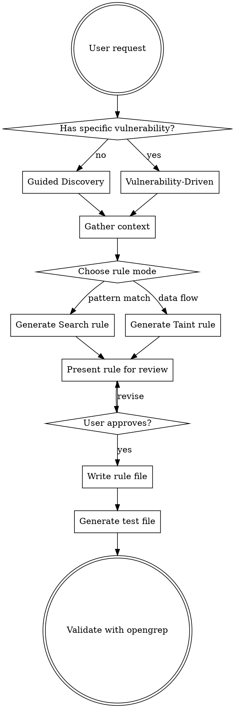

# Opengrep Rule Generator

## Overview

Generate valid opengrep/semgrep YAML rules through collaborative dialogue. Supports two workflows: **guided** (interactive Q&A to discover what to detect) and **vulnerability-driven** (given CVEs, OWASP categories, or vulnerability descriptions, generate rules automatically).

## When to Use

- User says "create a rule", "write a rule", "generate a rule", "detect [vulnerability]"
- User provides a CVE, CWE, or OWASP reference and wants detection rules
- User shares code snippets and asks "how do I catch this pattern?"
- User wants to scan a codebase for a class of vulnerabilities
- User asks to audit code for security issues and wants reusable rules

## Process Flow



## Reference Documentation

Before generating any rule, load context from these project docs:

| Doc | Path | Load When |
|-----|------|-----------|
| Rule syntax & templates | `docs/ai/RULES_SYNTAX.md` | Always — contains all operators, templates, language IDs |
| Rule index | `docs/ai/RULES_INDEX.md` | When checking for existing similar rules |
| Engine internals | `docs/ai/RULES_ENGINE.md` | When choosing between search vs taint mode |

Also search existing rules for similar patterns:
- `semgrep-rules/semgrep-rules/<language>/` — community rules
- `semgrep-rules-trailbits/<language>/` — Trail of Bits rules

## Workflow 1: Guided Discovery

Ask these questions **one at a time** to scope the rule:

### Step 1 — What are we detecting?

```
What vulnerability, bug pattern, or coding anti-pattern do you want to detect?

Examples:
- "SQL injection in our Flask app"
- "Hardcoded secrets in config files"
- "Missing null checks after API calls"
- "Insecure deserialization"
- "Race conditions in Go goroutines"
```

### Step 2 — What language and frameworks?

```
What programming language(s) and frameworks are involved?

I support 30+ languages including: python, javascript, typescript, java, go,
ruby, php, csharp, c, rust, scala, kotlin, swift, terraform/hcl, yaml,
dockerfile, solidity, and more. I also support 'generic' for config files
and 'regex' for raw text matching.
```

### Step 3 — Show me the vulnerable code

```
Can you show me an example of the VULNERABLE code you want to catch?
And if possible, also show the SAFE version (the fix)?

This helps me write precise patterns with fewer false positives.
```

### Step 4 — Where does user input enter? (if applicable)

```
Does this vulnerability involve untrusted user input flowing into a dangerous function?

If yes, I'll use TAINT MODE (tracks data flow from sources to sinks).
If no, I'll use SEARCH MODE (structural pattern matching).

For taint mode, I need to know:
- Sources: Where does untrusted data come from? (HTTP requests, file reads, env vars, etc.)
- Sinks: Where is it dangerous? (SQL queries, system commands, file writes, etc.)
- Sanitizers: What makes the data safe? (escaping, validation, type casting, etc.)
```

### Step 5 — Severity and scope

```
How severe is this issue?
- CRITICAL/ERROR: Exploitable vulnerability, must fix
- WARNING/MEDIUM: Likely vulnerability, should fix
- INFO/LOW: Code smell or audit flag

Should the rule apply to all files, or specific paths only?
```

## Workflow 2: Vulnerability-Driven Generation

When given CVEs, CWEs, OWASP categories, or vulnerability descriptions:

1. **Research the vulnerability** — use the research plan below to gather full context
2. **Parse the vulnerability** — extract: affected language, vulnerable API/pattern, attack vector, fix
3. **Check existing rules** — search `semgrep-rules/` and `semgrep-rules-trailbits/` for coverage
4. **Determine rule mode**:
   - **Data flows from input to dangerous function** → Taint mode
   - **Dangerous function call or config pattern** → Search mode
   - **Text/config pattern without AST** → Regex/generic mode
5. **Generate rule(s)** — may produce multiple rules for different attack variants
6. **Present with explanation** of what each rule catches and known limitations

### Vulnerability Research Plan

Before generating rules, conduct research to ensure comprehensive coverage. Use WebSearch and WebFetch tools.

**Phase 1 — Understand the vulnerability:**
- Search `"<CVE/CWE ID>" vulnerability details` to get official descriptions
- Search `"<vulnerability type>" <language> exploit examples` for real-world attack patterns
- Fetch the CWE entry from `https://cwe.mitre.org/data/definitions/<ID>.html` for taxonomy, related weaknesses, and detection methods
- Fetch the OWASP page for the relevant category (e.g., `https://owasp.org/Top10/A03_2021-Injection/`)

**Phase 2 — Map language-specific attack surface:**
- Search `"<vulnerability>" <framework> cheat sheet site:cheatsheetseries.owasp.org`
- Search `"<vulnerability>" <framework> security best practices`
- Identify: entry points (sources), dangerous APIs (sinks), safe alternatives (sanitizers)
- Search `"<vulnerable function>" CVE` to find real CVEs demonstrating the pattern

**Phase 3 — Study existing detection:**
- Search `semgrep rule "<vulnerability type>" <language>` for community rules
- Search existing rules in `semgrep-rules/` and `semgrep-rules-trailbits/` directories
- Note what's covered and what gaps remain

**Phase 4 — Document findings:**
Write a brief research summary as a YAML comment block at the top of the rule file:
```yaml
# Research: <vulnerability type> in <language/framework>
# Sources: <where untrusted data enters>
# Sinks: <where data becomes dangerous>
# Sanitizers: <what makes data safe>
# References researched:
#   - <url1>
#   - <url2>
# Coverage gaps found: <what existing rules miss>
```

### Mode Selection Guide

| Vulnerability Type | Rule Mode | Why |
|-------------------|-----------|-----|
| SQL injection | Taint | User input → query function |
| XSS | Taint | User input → HTML output |
| Command injection | Taint | User input → exec/system |
| SSRF | Taint | User input → HTTP request |
| Path traversal | Taint | User input → file operation |
| Hardcoded secrets | Search + regex | Pattern match on literals |
| Insecure config | Search | Structural pattern on config |
| Missing auth checks | Search (inside/not-inside) | Absence of pattern |
| Race conditions | Search (inside + not-inside) | Pattern within goroutine/thread |
| Weak crypto | Search | Specific API calls |
| Deserialization | Search or Taint | Depends on if input-controlled |
| Terraform misconfig | Search | HCL structural patterns |

## Rule Generation Template

When generating a rule, always produce this complete structure:

```yaml
rules:
  - id: <company-or-project>-<language>-<vuln-type>
    message: >-
      <1-3 sentences: what was found, why it's dangerous, how to fix it>
    severity: <ERROR|WARNING|INFO>
    languages: [<language>]
    metadata:
      category: <security|correctness|best-practice|performance>
      cwe:
        - "CWE-XXX: <Description>"
      owasp:                          # include if security rule
        - "A0X:2021 - <Category>"
      references:
        - <url-to-documentation>
      technology:
        - <framework-or-library>
      subcategory:
        - <vuln|audit>
      confidence: <HIGH|MEDIUM|LOW>
      likelihood: <HIGH|MEDIUM|LOW>
      impact: <HIGH|MEDIUM|LOW>
    # ... pattern operators or taint spec ...
```

### Naming Convention

Rule IDs: `<scope>-<language>-<vuln-type>[-<variant>]`
- `myapp-python-sql-injection`
- `myapp-go-race-condition-map-write`
- `myapp-java-spring-ssrf`

### Message Quality

Good messages include:
1. **What** was detected (the pattern)
2. **Why** it's dangerous (the risk)
3. **How** to fix it (the remediation)

```yaml
message: >-
  User input from `flask.request` is concatenated into a SQL query string
  passed to `cursor.execute()`. This could allow SQL injection, letting an
  attacker read or modify database contents. Use parameterized queries instead:
  `cursor.execute("SELECT * FROM users WHERE id = %s", (user_id,))`.
```

## Test File Generation

Always generate a companion test file with:

```python
# === True Positives (MUST trigger) ===

# ruleid: <rule-id>
<vulnerable code example 1>

# ruleid: <rule-id>
<vulnerable code example 2 — different variant>

# === True Negatives (must NOT trigger) ===

# ok: <rule-id>
<safe code — using the recommended fix>

# ok: <rule-id>
<safe code — different safe pattern>
```

**Minimum:** 2 true positives + 2 true negatives per rule.

## Advanced Patterns Cookbook

### Detect missing security check (pattern-not-inside)

```yaml
patterns:
  - pattern: dangerous_operation(...)
  - pattern-not-inside: |
      if <... auth_check(...) ...>:
        ...
```

### Detect tainted string concatenation (taint + metavariable-regex)

```yaml
mode: taint
pattern-sources:
  - pattern: request.args.get(...)
pattern-sinks:
  - patterns:
      - pattern: |
          "$SQLSTR" + ...
      - metavariable-regex:
          metavariable: $SQLSTR
          regex: \s*(?i)(select|delete|insert|create|update|alter|drop)\b.*
```

### Detect weak config values (metavariable-comparison)

```yaml
patterns:
  - pattern-inside: |
      resource "aws_s3_bucket" "..." {
        ...
        versioning { days = $DAYS }
        ...
      }
  - metavariable-comparison:
      metavariable: $DAYS
      comparison: $DAYS < 90
```

### Detect across multiple call variants (pattern-either + metavariable-regex)

```yaml
patterns:
  - pattern-either:
      - pattern: $OBJ.$METHOD(...)
      - pattern: $MODULE.$METHOD(...)
  - metavariable-regex:
      metavariable: $METHOD
      regex: (eval|exec|compile|unsafe_load)
```

### Detect with type constraints (typed metavariables)

```yaml
# Go: match only http.Request types
pattern: ($REQ : *http.Request).$FIELD
```

### Multi-step taint with labels

```yaml
mode: taint
pattern-sources:
  - patterns:
      - pattern: request.get_param(...)
    label: USER_INPUT
  - patterns:
      - pattern: $X + $Y
    label: CONCATENATED
    requires: USER_INPUT
pattern-sinks:
  - patterns:
      - pattern: db.execute(...)
    requires: CONCATENATED
```

## Reducing False Positives

After generating a rule, always consider adding:

1. **pattern-not** — exclude safe variants (`pattern-not: func("...", ...)` for literal strings)
2. **pattern-not-inside** — exclude safe contexts (inside try/catch, inside sanitization wrapper)
3. **metavariable-regex** — restrict metavariable values to dangerous ones
4. **Safe type exclusions** — `options: { taint_assume_safe_numbers: true, taint_assume_safe_booleans: true }`
5. **Log/print exclusions** — `pattern-not-inside: $LOG.info(...)` to avoid flagging logging

## Validation Checklist

Before finalizing any rule:

- [ ] Rule ID is unique and follows kebab-case
- [ ] `languages` field matches the target code
- [ ] Message explains what, why, and how-to-fix
- [ ] Metadata includes CWE and OWASP where applicable
- [ ] At least 2 true positive test cases
- [ ] At least 2 true negative test cases
- [ ] False positive reducers considered (pattern-not, safe type options)
- [ ] Rule tested with `opengrep scan --config <rule.yaml> <test-file>` if available

## Batch Generation

When asked to generate rules for a class of vulnerabilities (e.g., "OWASP Top 10 for Python Flask"):

1. List all applicable vulnerability categories
2. Check existing coverage in `semgrep-rules/`
3. Identify gaps
4. Generate rules for gaps only
5. Present as a table: | Vulnerability | Existing Rule? | New Rule ID | Mode |

## Rule Generation Methodology

Follow this systematic process to generate high-quality rules:

### 1. Understand the Vulnerability Deeply

**Don't just pattern-match on function names.** Understand:
- **What makes it dangerous?** (the root cause, not the symptom)
- **What's the attack scenario?** (how does an attacker exploit this?)
- **What's the data flow?** (source → transformation → sink)
- **What are ALL the variants?** (string concat, format strings, template literals, f-strings)
- **What are the safe alternatives?** (parameterized queries, template engines, escaping functions)

### 2. Study Existing Rules as Templates

Before writing from scratch, search existing rules for similar patterns:
```
semgrep-rules/semgrep-rules/<language>/<framework>/security/
semgrep-rules-trailbits/<language>/
```
Read the best-quality rules and adapt their patterns. Existing rules show:
- Which sources are standard for each framework
- Which metavariable-regex patterns reduce false positives
- How pattern-not exclusions are structured
- What metadata fields and CWE/OWASP mappings to use

### 3. Build Source-Sink-Sanitizer Maps

For each language/framework, document:

| Component | Examples |
|-----------|----------|
| **Sources** (user input entry points) | `request.args`, `req.query`, `$_GET`, `params[:]` |
| **Sinks** (dangerous output points) | `res.send()`, `echo`, `innerHTML`, `cursor.execute()` |
| **Sanitizers** (safe transformations) | `escape()`, `htmlspecialchars()`, `parseInt()`, template engines |
| **Propagators** (data structure flow) | `StringBuilder.append()`, `HashMap.put()`, `array.push()` |

### 4. Apply Defense-in-Depth Pattern Writing

Write rules in layers:
1. **Broad taint rule** — catches the primary attack vector
2. **Specific search rules** — catches dangerous API misuse (e.g., `dangerouslySetInnerHTML`)
3. **Config/audit rules** — flags risky configurations (e.g., `autoescape off`)

### 5. Iterate on False Positive Reduction

After initial rule generation:
1. Think through common safe patterns that would trigger
2. Add `pattern-not` for safe literals, safe types, logging
3. Add `pattern-not-inside` for try/catch, validation wrappers
4. Set `taint_assume_safe_numbers: true` and `taint_assume_safe_booleans: true`
5. Use `metavariable-regex` to restrict to dangerous method names

### Full Context: Reference Documentation

When generating rules, these docs contain the complete rule schema:

| What You Need | Where to Find It |
|--------------|------------------|
| All pattern operators | `docs/ai/RULES_SYNTAX.md` §3-5 |
| Taint mode spec (sources/sinks/sanitizers/propagators/labels) | `docs/ai/RULES_SYNTAX.md` §6 |
| Metavariable conditions (regex, comparison, type, pattern) | `docs/ai/RULES_SYNTAX.md` §4 |
| All supported languages | `docs/ai/RULES_SYNTAX.md` §9 |
| Rule templates (8 complete examples) | `docs/ai/RULES_SYNTAX.md` §12 |
| How the engine matches patterns | `docs/ai/RULES_ENGINE.md` §2 |
| How taint analysis works internally | `docs/ai/RULES_ENGINE.md` §3 |
| Existing rule coverage by language | `docs/ai/RULES_INDEX.md` |
| CWE/OWASP metadata conventions | `docs/ai/RULES_SYNTAX.md` §7 |
| Rule options (engine config) | `docs/ai/RULES_SYNTAX.md` §8 |

### Generated Rules Directory

Store generated rules in `custom-rules/<vuln-type>/` with companion test files:
```
custom-rules/
  xss/
    xss-python-flask.yaml     # Rules
    xss-python-flask.py       # Test file
  sqli/
    sqli-java-spring.yaml
    sqli-java-spring.java
```

## Common Mistakes to Avoid

| Mistake | Fix |
|---------|-----|
| Pattern too broad (`$FUNC(...)`) | Add `metavariable-regex` or `pattern-inside` to constrain |
| Missing ellipsis in function bodies | Use `...` in function/class bodies for flexible matching |
| Forgetting `pattern-not` for safe variants | Always consider: what does the SAFE code look like? |
| Wrong language ID | Check docs/ai/RULES_SYNTAX.md Section 9 for valid IDs |
| Taint without sanitizers | Always ask: what makes this data safe? Add sanitizers. |
| Hardcoding framework versions | Use `...` for version-agnostic patterns |
| Not testing negatives | False positives destroy trust — test safe code paths |
